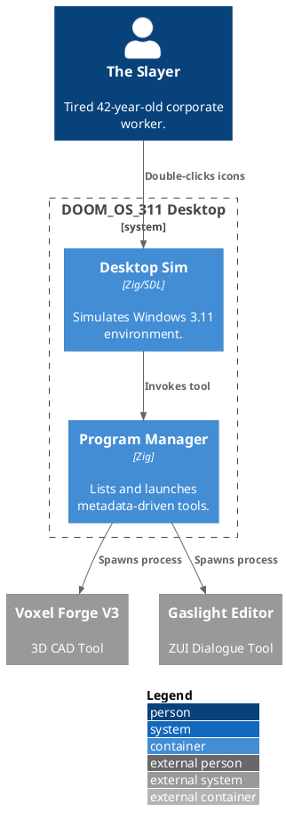
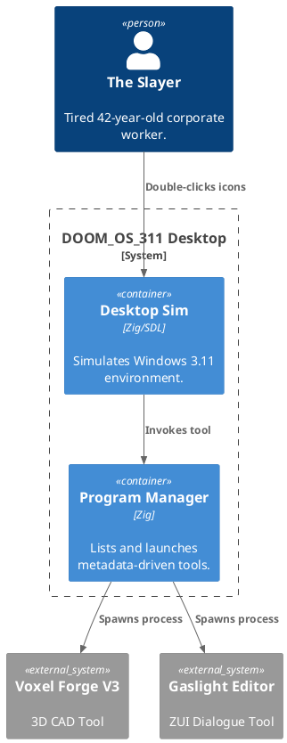

# REQUISITION FOR RESOURCE ALLOCATION (RRA) - DOOM_OS_311
**Status**: DRAFT / PENDING REVIEW
**Approver**: [USER]
**Slayer Age Reference**: 42

## 1. Executive Summary
To optimize tool discovery and reduce the "Command Line Fatigue" of the 42-year-old Slayer, we propose the **DOOM_OS_311** Desktop Simulator. This application will serve as a central hub (Program Manager) for all helper tools (Voxel Forge, Gaslight Editor, etc.), mimicking the nostalgic efficiency of Windows 3.11.

## 2. Architecture Views (PlantUML)

PlantUML Source

## 3. Technical Justification
- **Look & Feel**: Adheres to `doom_editor_ui_standards`. 4-quadrant baseline applied to the "Program Manager" window.
- **DOD impact**: Tool metadata will be handled as an SoA batch: `names: []const u8`, `icons: []QoiImage`, `exec_paths: []const u8`.
- **Latency**: Zero garbage collection for "snappy" 1992-style window dragging.

## 4. Stakeholder Commentary
| Stakeholder | Perspective / Commentary |
| :--- | :--- |
| **Architect** | "Use a PoolAllocator for the window segments. I don't want fragmentation when dragging icons." |
| **CEO** | "Windows 3.11? High nostalgia coefficient. Increases stock value." |
| **UX** | "The double-click threshold must be exactly 500ms. No modern 'kinetic' scrolling." |
| **Lawyer** | "Avoid using the 'Windows' logo. Call it 'Windooms'." |
| **HR** | "Ensure there is a 'Solitaire' clone for productivity breaks." |

## 5. Implementation Timeline
- **Sprint 1**: Desktop rendering and .QOI icon loading.
- **Sprint 2**: Window management and external process spawning.
