# Architecture: Core Physics System

## Visualizations

### 1. Class Diagram
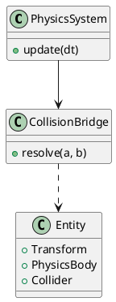

### 2. Behavioral Diagram
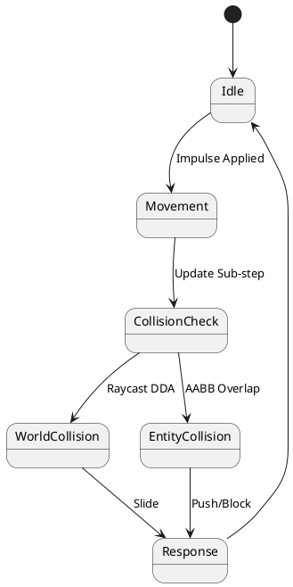

### 3. Sequence Diagram
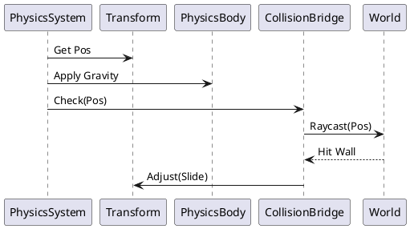

### 4. Component Diagram
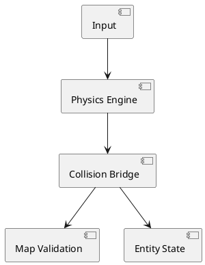

### 5. State Diagram
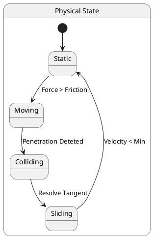

### 6. Activity Diagram
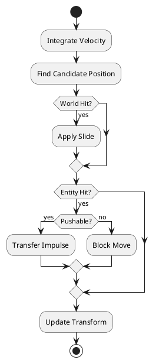

### 7. Use Case Diagram
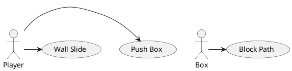

### 8. Object Diagram
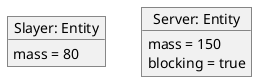

### 9. Timing Diagram
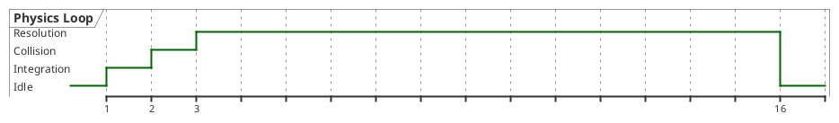

### 10. Deployment Diagram
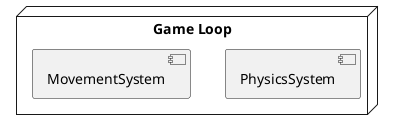

### 11. Package Diagram
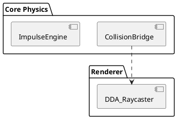

### 12. Profile Diagram
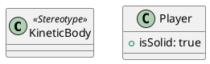

### 13. File Structure Diagram
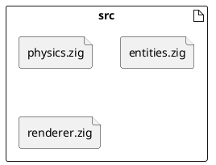
