# Architecture: Map Forge Editor

## Visualizations

### 1. Class Diagram (The Hierarchy)
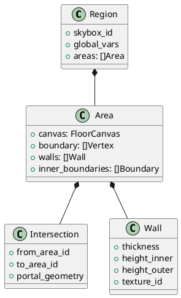

### 2. Sequence Diagram (Wall Generation)
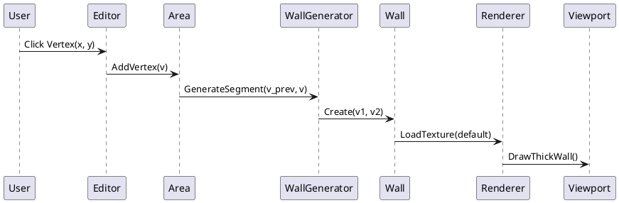

### 3. Behavioral Diagram (Editor Modes)
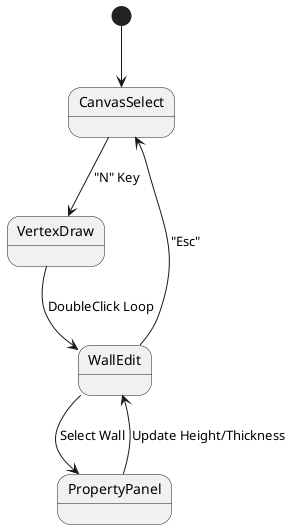

### 4. Component Diagram
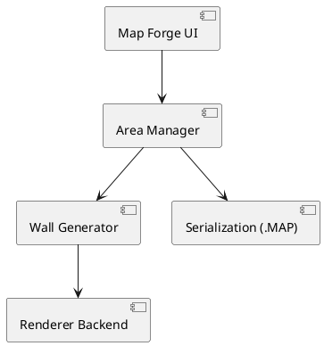

### 5. State Diagram (Area Lifecycle)
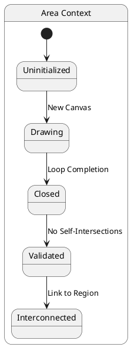

### 6. Activity Diagram (Physics Bridge)
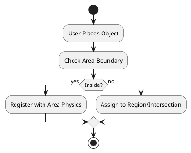

### 7. Use Case Diagram
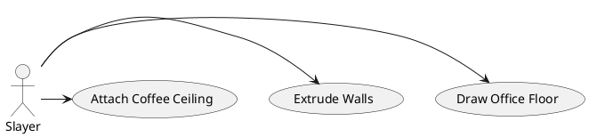

### 8. Object Diagram (Example Office)
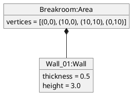

### 9. Timing Diagram (Procedural Gen)
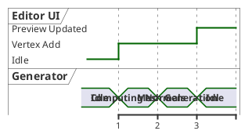

### 10. Deployment Diagram
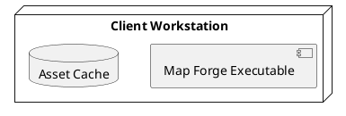

### 11. Package Diagram
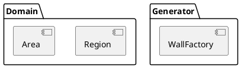

### 12. Profile Diagram
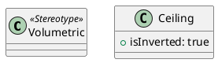

### 13. File Structure Diagram
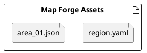
