# Architecture: Modern FPS Movement
**name**: MODERN_MOVEMENT
**icon**: assets/game/objects/weapon/icon.qoi
**exec**: src/main.zig

## Standards Compliance
- [Asset Organization Standards](file:///home/glauber/arquivos/projetos/code-labs/the-last-coffe-brak-at-doom/docs/architecture/asset_organization_standards.md)
- [Architecture Documentation Standards](file:///home/glauber/arquivos/projetos/code-labs/the-last-coffe-brak-at-doom/docs/architecture/architecture_documentation_standards.md)
- [Backlog Management Standards](file:///home/glauber/arquivos/projetos/code-labs/the-last-coffe-brak-at-doom/docs/architecture/backlog.md)

## Visualizations

### 1. Class Diagram

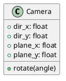

### 2. Behavior Diagram

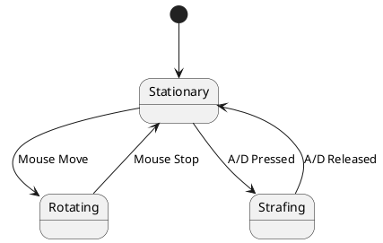

### 3. Sequence Diagram

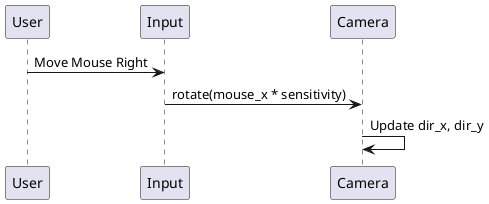

### 4. Component Diagram

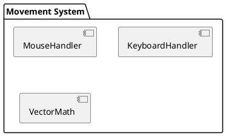

### 5. State Diagram

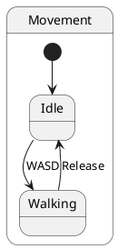

### 6. Activity Diagram

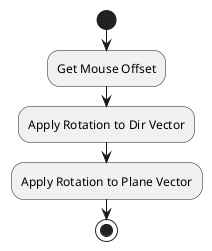

### 7. Use Case Diagram

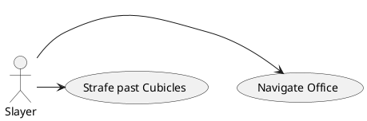

### 8. Object Diagram

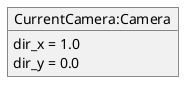

### 9. Timing Diagram

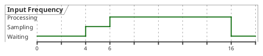

### 10. Deployment Diagram

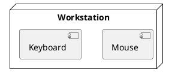

### 11. Package Diagram

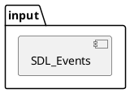

### 12. Profile Diagram

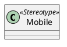

### 13. File Structure Diagram

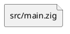
