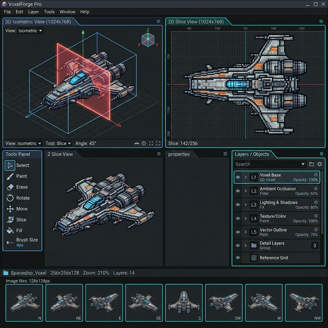

# Documento de Requisitos: D.O.O.M. Voxel Forge V3 (Plane-Cutting UI)

Baseado no layout conceitual gerado na V3 (visual batizado como "VOXELSCRIPT 3.2"), este documento consolida a arquitetura exata de UX/UI da nossa ferramenta e o comportamento do Plane-Cutting.

## 1. 3D Viewport (Painel Esquerdo - Superior)
- **Função:** Visualizador Interativo da geometria.
- **Controles de Mouse (Navegação Espacial):**
    - **Orbit (Botão Esquerdo):** Clicar e arrastar rotaciona a câmera livremente em torno do centro do modelo (Yaw/Pitch).
    - **Pan (Botão Direito):** Clicar e arrastar move o ponto de vista lateralmente ou verticalmente.
    - **Zoom (Scroll):** A roda do mouse aproxima ou afasta a câmera (Escala).
    - **Reset (Duplo Clique):** Retorna a câmera para a posição isométrica neutra (45°, Zoom 1.0).
- **Bússola 3D (Gizmo):** No canto da viewport, um conjunto de eixos (X-Vermelho, Y-Verde, Z-Azul) aponta sempre para a orientação real do mundo, servindo de guia espacial.
- **Toggles (Checkboxes de Display):** Diretamente listados abaixo dos ícones. Permitem ligar/desligar instantaneamente opções cruciais: a Geometria nativa, o `Grid` do chão Isométrico e a exibição do próprio polígono do `Plane` (o corte vertical).
- **Glowing Plane (Lâmina Transmissora):** Um plano retangular preenchido de neon/gradiente transparente que atravessa exatamente a seção fatiada da camada ativa. 

## 2. Global Control (Painel Esquerdo - Inferior)
- **Auto Play:** Um simples botão `Play` que efetua a animação fluída (Play/Pause) deslizando automaticamente a fatura pelos layers da geometria (afecta a camada selecionada).
- **Plane Opacity:** Mini-slider secundário capaz de variar a visibilidade restrita do elemento de neon na *3D Viewport* caso esse esteja obfuscrando nuances do objeto.
- **Global Export:** Botão para disparar a geração de QOI/GIF.

## 3. 2D Slice Viewer (Painel Direito - Superior)
- **A Prancheta de Escultura:** Apresenta a matriz *Cross-Section* totalmente bidimensional ortográfica que reflete *somente* as peças seccionadas pelo 'Glowing Plane' do layer ativo.
- **Top HUD:** Telemetria sutil nos cantos indicando o Layer ativo e *Zoom*.
- **Sistema de Camadas Múltiplas (Independent Slicing):** O fluxo de trabalho 2D atua em pilha de camadas. Cada sub-camada possui seu próprio **Eixo (X, Y, Z)** e **Profundidade (Slice Index)** armazenados de forma independente.
    - Isso permite que o usuário pinte em uma "parede" (Eixo X) em uma camada, e em um "piso" (Eixo Z) em outra, visualizando a interseção no 3D Viewport simultaneamente.

  

  Os tipos de layers são:
    - **Voxel Layer:** Pintura primitiva; pixels geram direta e fisicamente os cubos maciços 3D em malha.
    - **Geometry/Volume Layer:** Uma camada procedural pautada em Vetores. O usuário cria nós e trajetórias (pontos formando retas fechadas ou abertas) e o sistema desenha voxels pelo percurso. Por reter a "memória da forma" originalmente matemática, o usuário pode agrupar e rotacionar geometrias infinitamente em bando sem destruir os pixels.
    - **Occlusion Layer (Subtração e Alfa):** Atua como máscara que apaga e embute transparência (alpha-blend) nos pixels adjacentes e interligados debaixo dela.
    - **Ilumination/Shading Layer (Mapa Pós-Processo):** Modulador matemático unicamente luminoso; clareia ou obscurece forçadamente as camadas de voxel abaixo, preservando integridade geométrica.
    - **Texture Layer (Sub-Resolução):** Permite pinchar uma face volumétrica de um simples Voxel 3D e subdividi-la intensamente. A resolução local por matriz vai de `2x2`, `4x4` cruzando até blocos hiper-detalhistas de `64x64`, onde o usuário pinta livremente o estofamento da face externa (HD Textures over Voxels).
    - **Bump Map Layer:** Semelhante à *Texture Layer* em densidade de Pixels, porém aplica perturbações e deslocamentos milimétricos no eixo tridimensional para provocar rugosidades (*micro-relevos*) superficiais no raster.

## 4. Slice Tools & Palette (Rodapé Frontal e Lateral)
- **Slice Tools:** O agrupamento de ferramentas sobre o bloco 2D: `Pencil`, `Brush`, `Erase`, `Fill` e Box Transformativo.
- **Palette (Paleta Colorida):** *Swatches* puros gerenciando injeção em *Hex*.

## 5. Grade de Prévia Sprint (Bottom-Tiles)
- **8-Direction Render Array:** Localizada na fundação da área 3D (Rodapé esquerdo) ou base geral inferior do aplicativo, existirá uma esteira contínua apresentando **8 Tiles Quadráticos Fixos**. Eles monitoram o Voxel ao vivo fatiando-o em visualização plena a 0°, 45°, 90°, etc.
- **Flat-Render (Modo sem Sombras):** Como requisito absoluto para geração limpa de *Sprites/QOI Assets*, estes 8 quadrados exibirão a engrenagem livre de modelagem de luzes nativas — o visualizador 3D principal pode possuir iluminação dramática, mas o *Bottom-Tiles* deve sempre exibir cores absolutas "sem renderizar sombras" (Albedo Nativo).
- **Consolidated GIF Export:** Além da geração de arquivos individuais `.qoi`, o exportador deve gerar um arquivo `.gif` único contendo a animação das 8 direções em loop, facilitando a prévia rápida do asset fora da engine.
