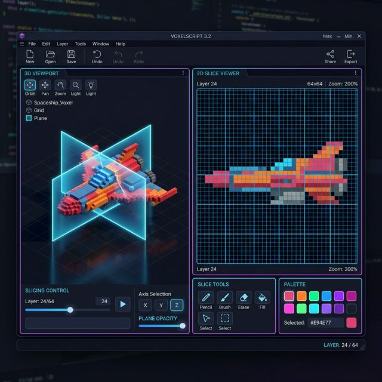

# Documento de Requisitos: D.O.O.M. Voxel Forge V3 (Plane-Cutting UI)

Este documento delimita a proposta arquitetural para a reformulação da interface (UI/UX) do **Voxel Forge**, focando na construção de um layout imersivo tipo *Slicer* integrado. O objetivo é permitir que o usuário compreenda e visualize de forma tátil exatamente onde sua planificação 2D está interceptando o volume 3D.

## 1. Visão Geral do Layout (Side-by-Side)
A experiência do app abandonará janelas flutuantes aleatórias para adotar um layout estrito e bloqueado em duas imensas colunas:

*(Esboço Conceitual: Visão 3D seccionada à esquerda, Slicer Controls centralizados horizontalmente abaixo e a prancheta de desenho isolada no painel à direita)*

## 2. O Painel Principal (3D Viewport)
- **Localização:** Ocupa a Metade Esquerda da aplicação (Centro-Esquerda).
- **Função:** Renderizar a escultura 3D em tempo real enquanto permite rotação livre contínua em múltiplos ângulos (360 graus completos).
- **O Plano de Corte Visível (Glass Plane):** A maior inovação mecânica. O visualizador 3D não deve apenas recortar os voxels geometricamente; ele deve desenhar um **Polígono Translúcido** (simulando uma malha de vidro neon ou grade flutuante brilhante) atravessando a estátua na coordenada dimensional exata orientada pelo Slider.
- **Ghosting de Massa Ocluída:** Os voxels volumétricos da sua estátua que estiverem localizados "acima" ou "nas costas" do plano de corte ativo não deverão desaparecer. Eles deverão ser renderizados com Alpha Blending elevado (50% translúcidos) ou no estilo Wireframe, permitindo que a "fatia sólida" interna brilhe sem que o usuário perca o senso de escala do modelo total.

## 3. Controles do Slicer (Fatiamento)
- **Localização:** Ancorados horizontalmente logo abaixo do Painel Principal 3D, mantendo os olhos do usuário alinhados verticalmente ao modelo.
- **Combo Seletor de Eixo:** Uma interface de botões mutuamente exclusivos (`XY`, `XZ` e `YZ`) que determina a direção ortogonal na qual a lâmina de vidro (Glass Plane) perfurará o ambiente 3D.
- **Slider de Profundidade:** Um deslizante numérico horizontal longo. Mover este slider transladará a Lâmina 3D deslizando-a suavemente pelos eixos no visualizador 3D, iluminando as entranhas maciças do volume frame a frame.

## 4. O Painel de Desenho (2D Layer Canvas)
- **Localização:** Fixante em toda a Metade Direita da tela, em paralelo imediato.
- **Função:** Apresenta a matriz orto-projetada puramente 2D. Esta tela exibe unicamente a *Cross-Section* dos blocos que são ativamente tocados pelo Plano de Corte Visível no horizonte 3D da esquerda.
- **Sincronia Direta:** Pintar ou apagar voxels usando ferramentas CAD (Lápis, Bresenham, Bucket) neste canvas instanciará geometria ativamente fixada na Placa de Vidro tridimensional do painel esquerdo.

## 5. Viabilidade Técnica com Rendering de SDL (Painter's Algorithm)
A conversão dessa premissa para o motor atual em C/Zig exige otimizar o Splatter:
- Alterar o `Z-Sort Algorithm` para separar os polígonos virtuais em duas listas: a lista "Frente do Plano de Corte", e a "Atrás do Plano de Corte".
- Renderizar a "Traseira" usando cores limpas.
- Desenhar a pseudo-Lâmina simulando um quadrilátero 2.5D com `SDL_BLENDMODE_BLEND`.
- Renderizar a "Frente Ocluída" usando modulação Alpha no `SDL_SetTextureColorMod` em tempo de rastreio, rebaixando substancialmente a opacidade global da face bloqueadora.
